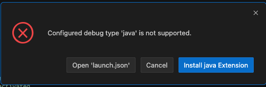
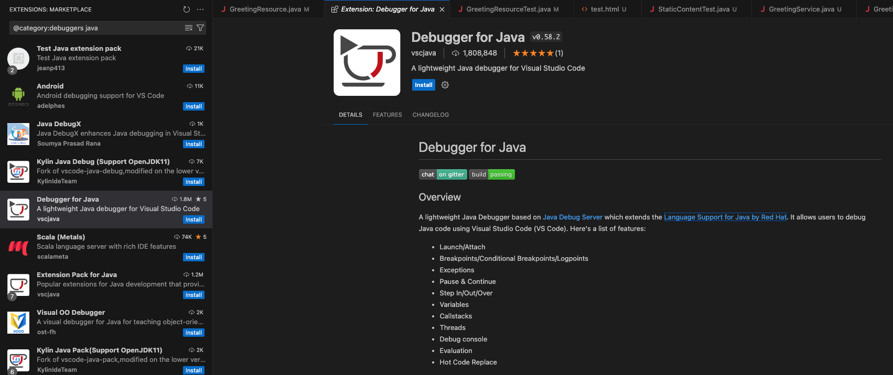
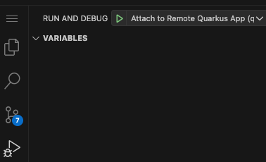
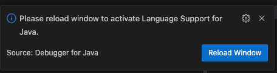

# Quarkus on OpenShift workshop


## Issues

**Debugger**

Debugger not installed and prompted the following screen:

 

Click on the `Install java Extension` button and install the following debugger from Red Hat



When you try to click on the button to start the debugger, the IDE will prompt you to install support `Java runtime/language`, choose `Yes` to install.



Once it is installed, you will be asked to Reload/Restart the IDE. Click `Yes` to restart.



It may take a while to reload, please wait patiently.

After IDE restarted, start the `Live Coding` again.

<!--**Error Starting Live Coding**

```
INFO] Deleting /projects/quarkus-workshop-m1m2-labs/target
[INFO] 
[INFO] --- quarkus:3.8.4.SP1-redhat-00001:dev (default-cli) @ people ---
[INFO] Invoking resources:3.3.1:resources (default-resources) @ people
[INFO] Copying 8 resources from src/main/resources to target/classes
[INFO] Invoking quarkus:3.8.4.SP1-redhat-00001:generate-code (default) @ people
[INFO] Invoking compiler:3.12.1:compile (default-compile) @ people
[INFO] Recompiling the module because of changed source code.
[INFO] Compiling 12 source files with javac [debug release 21] to target/classes
[INFO] Annotation processing is enabled because one or more processors were found
  on the class path. A future release of javac may disable annotation processing
  unless at least one processor is specified by name (-processor), or a search
  path is specified (--processor-path, --processor-module-path), or annotation
  processing is enabled explicitly (-proc:only, -proc:full).
  Use -Xlint:-options to suppress this message.
  Use -proc:none to disable annotation processing.
[INFO] Invoking resources:3.3.1:testResources (default-testResources) @ people
[INFO] skip non existing resourceDirectory /projects/quarkus-workshop-m1m2-labs/src/test/resources
[INFO] Invoking quarkus:3.8.4.SP1-redhat-00001:generate-code-tests (default) @ people
[INFO] Invoking compiler:3.12.1:testCompile (default-testCompile) @ people
[INFO] Recompiling the module because of changed dependency.
[INFO] Compiling 2 source files with javac [debug release 21] to target/test-classes
[INFO] Annotation processing is enabled because one or more processors were found
  on the class path. A future release of javac may disable annotation processing
  unless at least one processor is specified by name (-processor), or a search
  path is specified (--processor-path, --processor-module-path), or annotation
  processing is enabled explicitly (-proc:only, -proc:full).
  Use -Xlint:-options to suppress this message.
  Use -proc:none to disable annotation processing.
ERROR: transport error 202: bind failed: Address already in use
ERROR: JDWP Transport dt_socket failed to initialize, TRANSPORT_INIT(510)
JDWP exit error AGENT_ERROR_TRANSPORT_INIT(197): No transports initialized [open/src/jdk.jdwp.agent/share/native/libjdwp/debugInit.c:700]
[INFO] ------------------------------------------------------------------------
```
-->
## Module 2 > Configure endpoint

- Use `https://swapi.info` instead of `https://swapi.dev`

- use `curl -s https://swapi.info/api/people/1 |jq`
	instead of `curl -s https://swapi.dev/api/people/1/ | jq`
- Use `/people/{id}` instead of `/people/{id}/` for `@Path`

	```java
	@RegisterRestClient 
	@Path("/api") 
	public interface StarWarsService {
	
	    @GET
	    @Path("/people/{id}") 
	    @Produces("application/json") 
	    @ClientHeaderParam(name="User-Agent", value="QuarkusLab") 
	    StarWarsPerson getPerson(@PathParam("id") int id); 
	}
	```

## Module 3 > 5. Spring Data JPA to Quarkus Hibernate ORM with Panache > Refactor Vets Persistence Layer

- Keep the following `listAll() comment out for `src/main/java/org/acme/model/Vet.java`

```
// public static List<Vet> listAll(){
    //     Vet vet = new Vet();
    //     vet.setFirstName("Daniel");
    //     vet.setLasttName("Oh");
    //     List vets = new ArrayList<Vet>();
    //     vets.add(vet);
    //     return vets;
    // }
```


